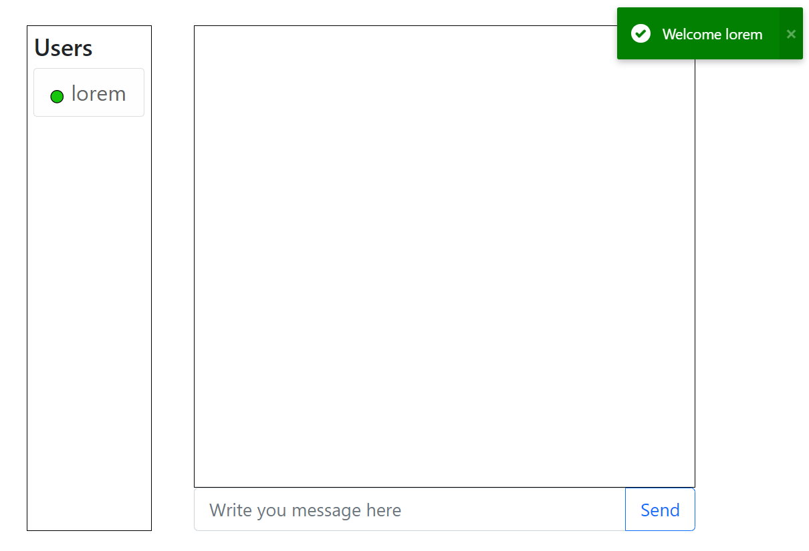

# Chat App

A simple chat app created with React, Node.js and Socket.io.  

## Description

The app is a simple chat app, it requires no registration from the user, it just checks that the name chosen by the user is not already used.  
The first page the user sees is the login page.  
<br>
  
<br>
After the user logs in he will see the main chat page.  
<br>
  
<br>
When a new user joins the chat it will tell everyone that that user joined the chat.  
<br>
  
<br>
Users can send public messages or private messages (PM), to send public message the user just need to type the message in the input element and click the send button/hitting the Enter key. In order to send PMs the user can click the other user name and the input will change to show that the message is a PM, to cancel the PM the user can just click the X button and the input will turn back to be for public messages.  
<br>
  
  
<br>
Lastly, if a user leaves the chat it will also tell everyone that that user left the chat.  
<br>
  

## Getting Started

### Dependencies

#### Front
* react ^17.0.2
* react-router-dom ^6.2.1
* axios ^0.24.0
* bootstrap ^5.1.3
* react-bootstrap ^2.0.4
* socket.io-client ^4.4.0
* notyf ^3.10.0
* font awesome 

#### Back
* cors ^2.8.5
* express ^4.17.2
* socket.io ^4.4.0

### Installing + Executing the program

1. Fork or clone this repo to your computer.  
2. Because the server serve the react app statically there is no need to touch the 'front' folder.  
3. In the terminal:
   ```bash
    cd back
    npm i
    npm start
   ``` 
4. Now you can use the app on http://localhost:8080  

### Using with Docker

1. Open the terminal (`ctrl + j`)  
2. In the terminal:
    ```bash
    docker run -d -p 8080:8080 chat-app
   ``` 
3. Now you can use the app on http://localhost:8080
4. If you want to use docker compose you can shut down and remove the container from the previous steps (only th container, NOT the image)
5. In the terminal:
    ```bash
    docker-compose up
   ```
6. Now the app runs with docker compose

## Version History

* 0.1
    * Initial Release
